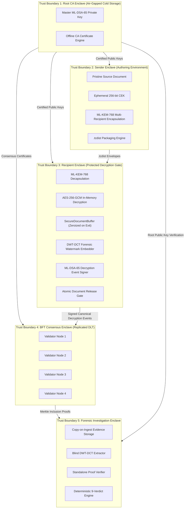
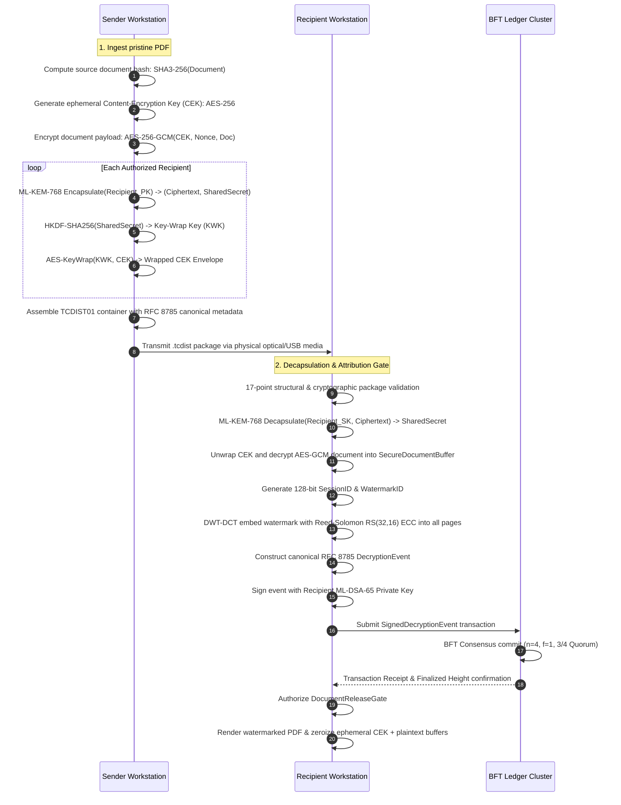
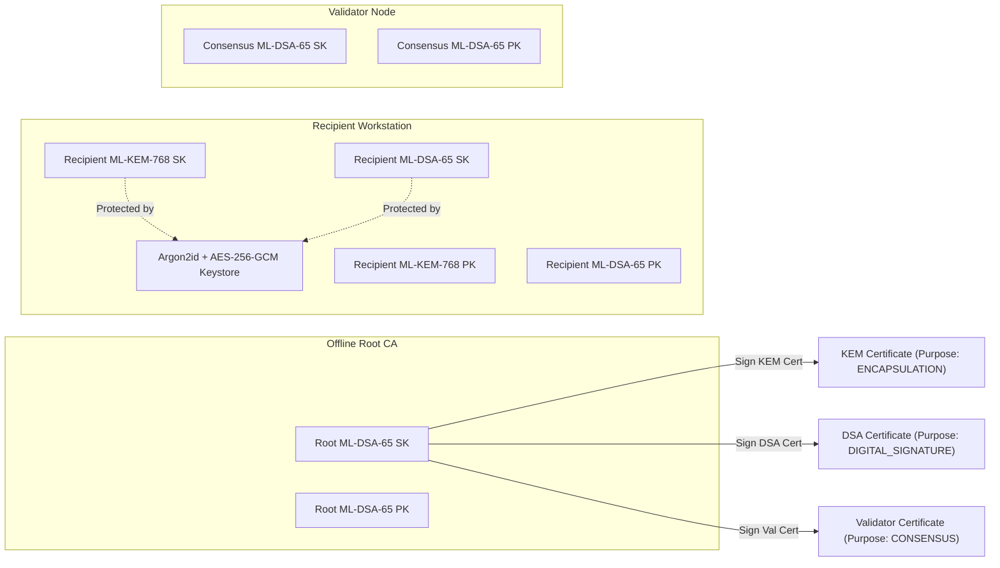
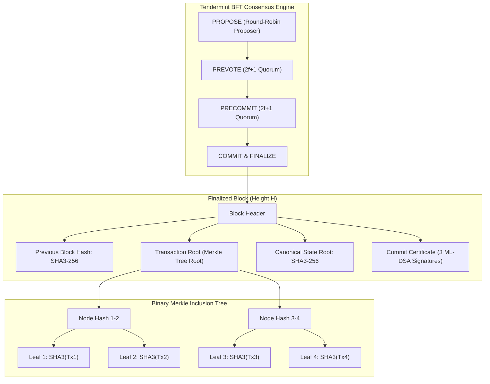
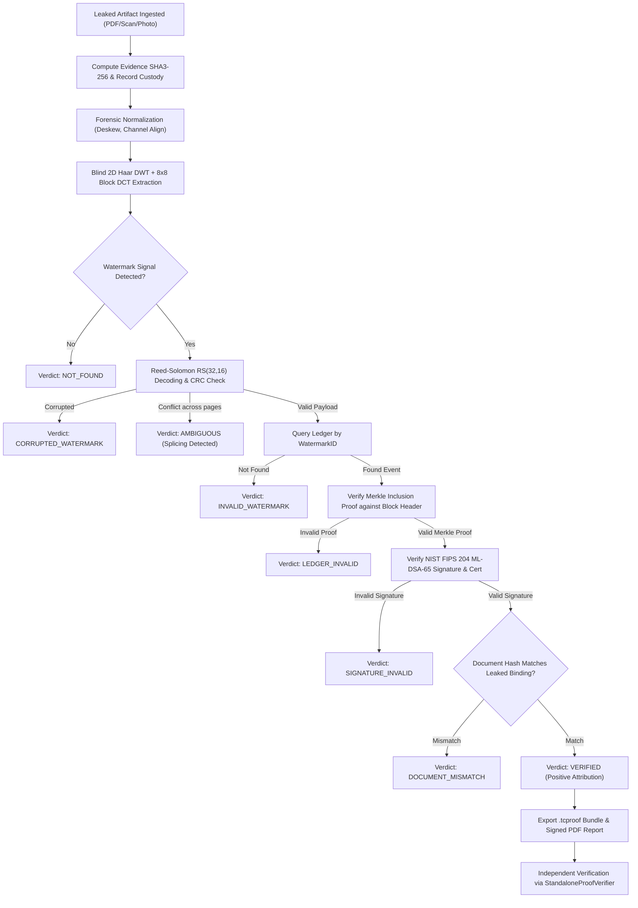

# TraceCrypt System Architecture Specification

**Product:** TraceCrypt  
**Version:** 1.0.0  
**Environment:** Air-Gapped / Isolated Secure LAN  
**Cryptographic Suite:** NIST FIPS 203 (ML-KEM-768), NIST FIPS 204 (ML-DSA-65), AES-256-GCM, SHA3-256  

---

## 1. High-Level System Architecture

TraceCrypt is composed of five distinct operational environments that communicate strictly via file-based exchange (`.tcdist`, `.tcproof`, `.tcbackup`) or private, permissioned, air-gapped inter-validator TCP connections.

```
                      ┌─────────────────────────────────┐
                      │    OFFLINE ROOT CA AUTHORITY    │
                      │  - Master ML-DSA-65 Signing Key │
                      │  - Identity & Role Certificates │
                      │  - Offline Revocation Registry  │
                      └────────────────┬────────────────┘
                                       │ Certified Keys & CRLs
         ┌─────────────────────────────┼─────────────────────────────┐
         ▼                             ▼                             ▼
┌──────────────────┐         ┌──────────────────┐         ┌──────────────────────┐
│SENDER WORKSTATION│         │RECIPIENT GATEWAY │         │ 4-NODE BFT CONSENSUS │
│- Document Source │         │- ML-KEM Decaps   │         │- Node 1 (127.0.0.1:9101)
│- SHA3-256 Hash   │         │- AES Decryption  │         │- Node 2 (127.0.0.1:9102)
│- CEK Generation  │         │- DWT-DCT Embed   │         │- Node 3 (127.0.0.1:9103)
│- ML-KEM-768 Wrap ├────────►│- Canonical Event ├────────►│- Node 4 (127.0.0.1:9104)
│- .tcdist Package │ .tcdist │- ML-DSA Signature│ Signed  │- Tendermint Consensus│
└──────────────────┘ Package │- Ledger Commit   │ Event   │- Binary Merkle Tree  │
                             │- Zeroization Gate│         │- Replicated SQLite   │
                             └────────┬─────────┘         └──────────┬───────────┘
                                      │                              │
                                      ▼ Exfiltration                 ▼ Proofs & State
                             ┌──────────────────┐         ┌──────────────────────┐
                             │ LEAKED ARTIFACT  │         │ INVESTIGATOR STATION │
                             │- PDF / Scan / Img│────────►│- Blind DWT-DCT Extr  │
                             │- Noise / Cropping│ Evidence│- Merkle Inclusion    │
                             └──────────────────┘         │- ML-DSA Verification │
                                                          │- 9-State Adjudication│
                                                          │- .tcproof & PDF Rep  │
                                                          └──────────────────────┘
```

---

## 2. Trust Boundaries & Security Enclaves



---

## 3. Cryptographic Data Flow

### 3.1 Document Packaging & Distribution Flow


---

## 4. Key Management & Lifecycle Flow



---

## 5. Ledger Consensus & Merkle Commitment Flow



---

## 6. Forensic Investigation & Adjudication Pipeline

When a leaked document artifact is imported, the investigator executes the deterministic 9-verdict adjudication pipeline:



---

## 7. Deterministic Nine-Verdict Reference Matrix

| Verdict | Forensic Meaning | Non-Repudiation Status | Admissibility |
|:---|:---|:---|:---|
| `VERIFIED` | Full cryptographic match: watermark, ledger, signature, and document binding clean. | Non-repudiated attribution | Fully Admissible |
| `DOCUMENT_MISMATCH` | Watermark valid and signed, but document hash differs from ledger event. | Document tampering detected | Inadmissible for source |
| `SIGNATURE_INVALID` | Event record modified or forged; ML-DSA signature failed verification. | Attribution forgery detected | Proof of tampering |
| `LEDGER_INVALID` | Merkle proof fails or block header hash diverges from consensus state. | Consensus state compromised | Inadmissible |
| `INVALID_WATERMARK` | Watermark decoded cleanly but was never committed to the ledger. | Counterfeit / unauthorized mark | Proof of forgery |
| `CORRUPTED_WATERMARK` | Signal detected but Reed-Solomon unrecoverable beyond error threshold. | Insufficient signal fidelity | Inconclusive |
| `AMBIGUOUS` | Conflicting valid watermarks detected across different document pages. | Document page splicing detected | Proof of splice |
| `UNVERIFIABLE` | Missing public keys, revoked Root CA, or incompatible protocol version. | Verification preconditions unmet | Inconclusive |
| `NOT_FOUND` | Zero watermark correlation detected across all document pages. | No TraceCrypt watermark present | Non-attributed |

---

## 8. Deployment Topology (Reference 4-Node Cluster)

| Node | Role | IP / Host | Port | Database Path | Key Location |
|:---|:---|:---|:---|:---|:---|
| `node-1` | Consensus Validator | `127.0.0.1` | `9101` | `cluster/node-1/ledger.db` | `cluster/node-1/validator_key.json` |
| `node-2` | Consensus Validator | `127.0.0.1` | `9102` | `cluster/node-2/ledger.db` | `cluster/node-2/validator_key.json` |
| `node-3` | Consensus Validator | `127.0.0.1` | `9103` | `cluster/node-3/ledger.db` | `cluster/node-3/validator_key.json` |
| `node-4` | Consensus Validator | `127.0.0.1` | `9104` | `cluster/node-4/ledger.db` | `cluster/node-4/validator_key.json` |
