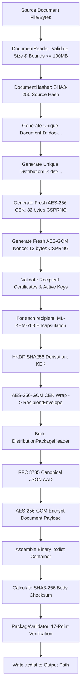
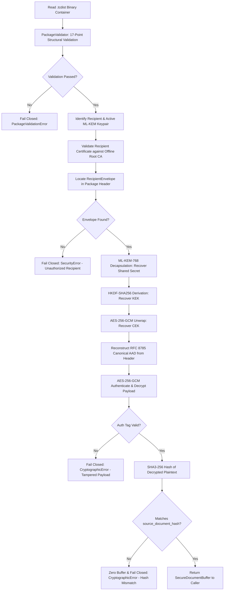

# Document Distribution Subsystem Architecture

## 1. Executive Summary & Objective

The **TraceCrypt Document Distribution Subsystem** provides a production-grade, post-quantum secure transport container (`.tcdist`) enabling confidential, authentic, and offline distribution of sensitive documents to multiple designated recipients across air-gapped workstations or disconnected networks.

The core architectural invariant is **single-content encryption with independent post-quantum key encapsulation**:
* The source document is encrypted exactly once using high-throughput symmetric authenticated encryption (**AES-256-GCM**).
* The 256-bit symmetric Content Encryption Key (CEK) is independently encapsulated for each authorized recipient using **NIST FIPS 203 ML-KEM-768**.
* The distribution package binds immutable package metadata (document ID, distribution ID, recipient list, source hash, algorithm parameters) directly to the ciphertext via **Additional Authenticated Data (AAD)**.
* Offline recipients can independently validate the container, verify their identity certificates against an offline Root CA, decapsulate the CEK, decrypt the document into a zeroizing memory buffer, and cryptographically verify the plaintext against the sender's original SHA3-256 source hash.

---

## 2. Core Architectural Invariants

| ID | Invariant | Enforcement Mechanism |
|---|---|---|
| **INV-DIST-01** | **Single Symmetric Encryption** | The document is encrypted exactly once per distribution with a fresh 256-bit random CEK. Bulk content is never re-encrypted per recipient. |
| **INV-DIST-02** | **No Bulk PQC Encryption** | ML-KEM-768 is exclusively used for key encapsulation (FIPS 203). It is never used to encrypt arbitrary document payloads. |
| **INV-DIST-03** | **Post-Quantum Only** | Classical public key cryptography (RSA, ECDH, DH) and unauthenticated symmetric modes (AES-CBC, CTR) are strictly prohibited. |
| **INV-DIST-04** | **Cryptographic AAD Binding** | All critical metadata in `DistributionPackageHeader` is canonicalized via RFC 8785 and injected as AAD into AES-256-GCM. Modifying any header field causes decryption failure. |
| **INV-DIST-05** | **Post-Decryption Plaintext Verification** | Decrypted plaintext is hashed with SHA3-256 and compared to `source_document_hash`. Any mismatch immediately zeroes the buffer and fails closed. |
| **INV-DIST-06** | **In-Memory Plaintext Management** | Decrypted documents are returned exclusively inside a `SecureDocumentBuffer` with active zeroization. Plaintext is never persisted to disk by the distribution subsystem. |
| **INV-DIST-07** | **Fail-Closed Offline Validation** | Every package must pass a 17-point structural and cryptographic validation pipeline before any decapsulation or decryption is attempted. |

---

## 3. High-Level Sender Workflow

---

## 4. High-Level Recipient Workflow

---

## 5. Subsystem Separation of Concerns

The distribution layer strictly isolates document packaging and transport from subsequent lifecycle operations:

1. **Phase 1-2 (Foundation & Identity):**
   * Supplies deterministic hashing, secure randomness, typed identifiers (`DocumentID`, `DistributionID`, `RecipientID`), and post-quantum identity certificates signed by the Offline Root CA.
2. **Phase 3 (Encrypted Document Distribution):**
   * Encapsulates content encryption, package building, package validation, recipient authorization, and in-memory decryption.
   * **Stops at the boundary of document release.**
3. **Phase 4-5 (Future Forensic Watermarking & Ledger):**
   * Will consume the `SecureDocumentBuffer` produced by `decrypt_package()`.
   * Will generate recipient-specific forensic watermarks (DWT-DCT / spread spectrum), embed them into the document, generate a signed decryption event, commit to the distributed ledger, and only then render or release the watermarked document.
   * Plaintext is never written unwatermarked to persistent disk.

---

## 6. Memory Confidentiality & Buffer Management

The distribution subsystem exposes decrypted document data via `SecureDocumentBuffer`:
* Underlying storage is a contiguous `bytearray`.
* The buffer provides explicit `zeroize()` capabilities which overwrite the memory with zeroes before releasing references.
* It implements the Python Context Manager protocol (`with buffer:`), guaranteeing zeroization upon block exit.
* While operating system page-swapping cannot be entirely prevented in pure Python without native kernel locks (`mlock`), `SecureDocumentBuffer` eliminates lingering references in Python heaps and explicitly forbids disk writes.
