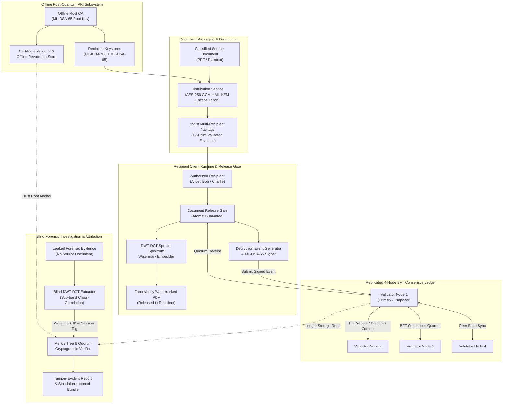

# TraceCrypt — System Architecture

```mermaid
graph TD
    subgraph OfflinePKI["Offline Post-Quantum PKI Subsystem"]
        CA["Offline Root CA<br/>(ML-DSA-65 Root Key)"]
        CertVal["Certificate Validator &<br/>Offline Revocation Store"]
        RecipKeys["Recipient Keystores<br/>(ML-KEM-768 + ML-DSA-65)"]
        CA --> CertVal
        CA --> RecipKeys
    end

    subgraph Packaging["Document Packaging & Distribution"]
        DocIn["Classified Source Document<br/>(PDF / Plaintext)"]
        DistService["Distribution Service<br/>(AES-256-GCM + ML-KEM Encapsulation)"]
        TcDist[".tcdist Multi-Recipient Package<br/>(17-Point Validated Envelope)"]
        DocIn --> DistService
        RecipKeys --> DistService
        DistService --> TcDist
    end

    subgraph ClientDecryption["Recipient Client Runtime & Release Gate"]
        Rcp["Authorized Recipient<br/>(Alice / Bob / Charlie)"]
        Gate["Document Release Gate<br/>(Atomic Guarantee)"]
        DwtDct["DWT-DCT Spread-Spectrum<br/>Watermark Embedder"]
        EventSign["Decryption Event Generator<br/>& ML-DSA-65 Signer"]
        DecPdf["Forensically Watermarked PDF<br/>(Released to Recipient)"]
        
        TcDist --> Rcp
        Rcp --> Gate
        Gate --> EventSign
        Gate --> DwtDct
        DwtDct --> DecPdf
    end

    subgraph BFTLedger["Replicated 4-Node BFT Consensus Ledger"]
        Val1["Validator Node 1<br/>(Primary / Proposer)"]
        Val2["Validator Node 2"]
        Val3["Validator Node 3"]
        Val4["Validator Node 4"]
        
        EventSign -->|Submit Signed Event| Val1
        Val1 <-->|PrePrepare / Prepare / Commit| Val2
        Val1 <-->|BFT Consensus Quorum| Val3
        Val1 <-->|Peer State Sync| Val4
        Val1 -->|Quorum Receipt| Gate
    end

    subgraph ForensicEngine["Blind Forensic Investigation & Attribution"]
        LeakedDoc["Leaked Forensic Evidence<br/>(No Source Document)"]
        BlindExtract["Blind DWT-DCT Extractor<br/>(Sub-band Cross-Correlation)"]
        LedgerAudit["Merkle Tree & Quorum<br/>Cryptographic Verifier"]
        AttributionReport["Tamper-Evident Report<br/>& Standalone .tcproof Bundle"]

        LeakedDoc --> BlindExtract
        BlindExtract -->|Watermark ID & Session Tag| LedgerAudit
        Val1 -.->|Ledger Storage Read| LedgerAudit
        CertVal -.->|Trust Root Anchor| LedgerAudit
        LedgerAudit --> AttributionReport
    end
```
