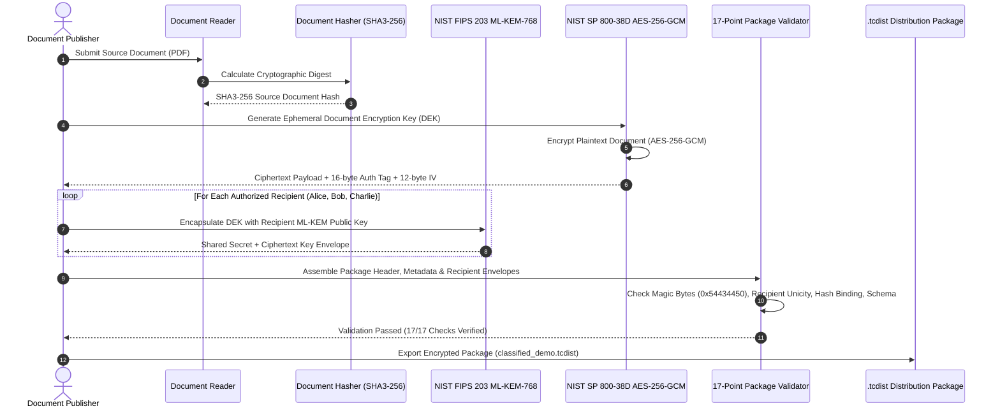

# TraceCrypt — Multi-Recipient Encryption & Packaging Pipeline

```mermaid
sequenceDiagram
    autonumber
    actor Publisher as Document Publisher
    participant Reader as Document Reader
    participant Hasher as Document Hasher (SHA3-256)
    participant KEM as NIST FIPS 203 ML-KEM-768
    participant AES as NIST SP 800-38D AES-256-GCM
    participant Val as 17-Point Package Validator
    participant Output as .tcdist Distribution Package

    Publisher->>Reader: Submit Source Document (PDF)
    Reader->>Hasher: Calculate Cryptographic Digest
    Hasher-->>Reader: SHA3-256 Source Document Hash
    
    Publisher->>AES: Generate Ephemeral Document Encryption Key (DEK)
    AES->>AES: Encrypt Plaintext Document (AES-256-GCM)
    AES-->>Publisher: Ciphertext Payload + 16-byte Auth Tag + 12-byte IV

    loop For Each Authorized Recipient (Alice, Bob, Charlie)
        Publisher->>KEM: Encapsulate DEK with Recipient ML-KEM Public Key
        KEM-->>Publisher: Shared Secret + Ciphertext Key Envelope
    end

    Publisher->>Val: Assemble Package Header, Metadata & Recipient Envelopes
    Val->>Val: Check Magic Bytes (0x54434450), Recipient Unicity, Hash Binding, Schema
    Val-->>Publisher: Validation Passed (17/17 Checks Verified)

    Publisher->>Output: Export Encrypted Package (classified_demo.tcdist)
```
