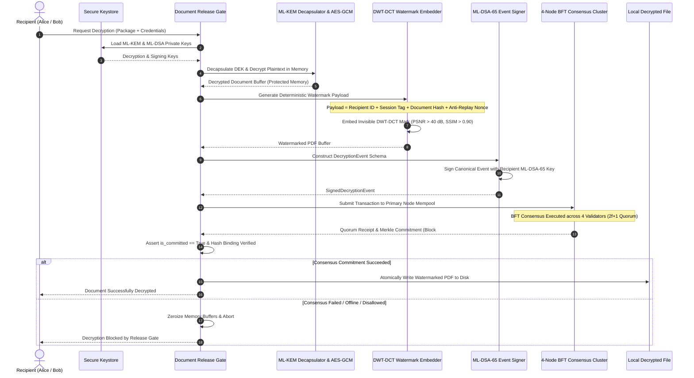

# TraceCrypt — Decryption Release Gate & Atomic Watermarking Pipeline

```mermaid
sequenceDiagram
    autonumber
    actor Recipient as Recipient (Alice / Bob)
    participant Keystore as Secure Keystore
    participant Gate as Document Release Gate
    participant Decryptor as ML-KEM Decapsulator & AES-GCM
    participant Watermarker as DWT-DCT Watermark Embedder
    participant Signer as ML-DSA-65 Event Signer
    participant BFT as 4-Node BFT Consensus Cluster
    participant Storage as Local Decrypted File

    Recipient->>Gate: Request Decryption (Package + Credentials)
    Gate->>Keystore: Load ML-KEM & ML-DSA Private Keys
    Keystore-->>Gate: Decryption & Signing Keys
    
    Gate->>Decryptor: Decapsulate DEK & Decrypt Plaintext in Memory
    Decryptor-->>Gate: Decrypted Document Buffer (Protected Memory)

    Gate->>Watermarker: Generate Deterministic Watermark Payload
    Note over Watermarker: Payload = Recipient ID + Session Tag + Document Hash + Anti-Replay Nonce
    Watermarker->>Watermarker: Embed Invisible DWT-DCT Mark (PSNR > 40 dB, SSIM > 0.90)
    Watermarker-->>Gate: Watermarked PDF Buffer

    Gate->>Signer: Construct DecryptionEvent Schema
    Signer->>Signer: Sign Canonical Event with Recipient ML-DSA-65 Key
    Signer-->>Gate: SignedDecryptionEvent

    Gate->>BFT: Submit Transaction to Primary Node Mempool
    Note over BFT: BFT Consensus Executed across 4 Validators (2f+1 Quorum)
    BFT-->>Gate: Quorum Receipt & Merkle Commitment (Block #H)

    Gate->>Gate: Assert is_committed == True & Hash Binding Verified
    alt Consensus Commitment Succeeded
        Gate->>Storage: Atomically Write Watermarked PDF to Disk
        Gate-->>Recipient: Document Successfully Decrypted
    else Consensus Failed / Offline / Disallowed
        Gate->>Gate: Zeroize Memory Buffers & Abort
        Gate-->>Recipient: Decryption Blocked by Release Gate
    end
```
