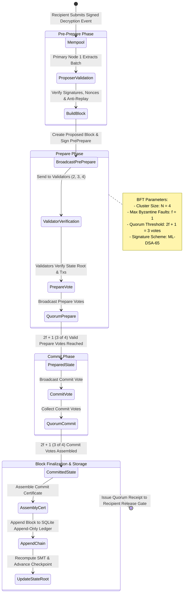

# TraceCrypt — Byzantine Fault Tolerant (BFT) Ledger Consensus

```mermaid
stateDiagram-v2
    [*] --> Mempool: Recipient Submits Signed Decryption Event
    
    state "Pre-Prepare Phase" as PrePrepare {
        Mempool --> ProposerValidation: Primary Node 1 Extracts Batch
        ProposerValidation --> BuildBlock: Verify Signatures, Nonces & Anti-Replay
        BuildBlock --> BroadcastPrePrepare: Create Proposed Block & Sign PrePrepare
    }

    state "Prepare Phase" as Prepare {
        BroadcastPrePrepare --> ValidatorVerification: Send to Validators (2, 3, 4)
        ValidatorVerification --> PrepareVote: Validators Verify State Root & Txs
        PrepareVote --> QuorumPrepare: Broadcast Prepare Votes
        QuorumPrepare --> PreparedState: 2f + 1 (3 of 4) Valid Prepare Votes Reached
    }

    state "Commit Phase" as Commit {
        PreparedState --> CommitVote: Broadcast Commit Vote
        CommitVote --> QuorumCommit: Collect Commit Votes
        QuorumCommit --> CommittedState: 2f + 1 (3 of 4) Commit Votes Assembled
    }

    state "Block Finalization & Storage" as Finalization {
        CommittedState --> AssemblyCert: Assemble Commit Certificate
        AssemblyCert --> AppendChain: Append Block to SQLite Append-Only Ledger
        AppendChain --> UpdateStateRoot: Recompute SMT & Advance Checkpoint
    }

    Finalization --> [*]: Issue Quorum Receipt to Recipient Release Gate

    note right of Prepare
        BFT Parameters:
        - Cluster Size: N = 4
        - Max Byzantine Faults: f = 1
        - Quorum Threshold: 2f + 1 = 3 votes
        - Signature Scheme: ML-DSA-65
    end note
```
