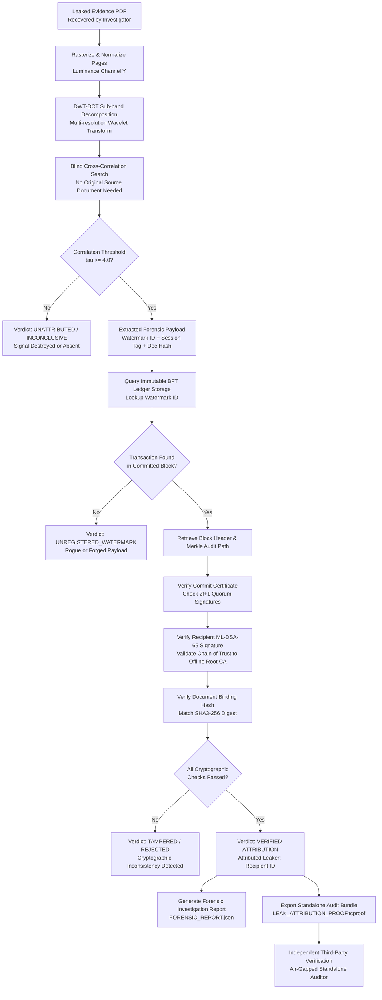

# TraceCrypt — Blind Forensic Investigation & Attribution Pipeline

```mermaid
flowchart TD
    A[Leaked Evidence PDF<br/>Recovered by Investigator] --> B[Rasterize & Normalize Pages<br/>Luminance Channel Y]
    B --> C[DWT-DCT Sub-band Decomposition<br/>Multi-resolution Wavelet Transform]
    C --> D[Blind Cross-Correlation Search<br/>No Original Source Document Needed]
    
    D --> E{Correlation Threshold<br/>tau >= 4.0?}
    E -- No --> F[Verdict: UNATTRIBUTED / INCONCLUSIVE<br/>Signal Destroyed or Absent]
    E -- Yes --> G[Extracted Forensic Payload<br/>Watermark ID + Session Tag + Doc Hash]

    G --> H[Query Immutable BFT Ledger Storage<br/>Lookup Watermark ID]
    H --> I{Transaction Found<br/>in Committed Block?}
    I -- No --> J[Verdict: UNREGISTERED_WATERMARK<br/>Rogue or Forged Payload]
    I -- Yes --> K[Retrieve Block Header & Merkle Audit Path]

    K --> L[Verify Commit Certificate<br/>Check 2f+1 Quorum Signatures]
    L --> M[Verify Recipient ML-DSA-65 Signature<br/>Validate Chain of Trust to Offline Root CA]
    M --> N[Verify Document Binding Hash<br/>Match SHA3-256 Digest]

    N --> O{All Cryptographic<br/>Checks Passed?}
    O -- No --> P[Verdict: TAMPERED / REJECTED<br/>Cryptographic Inconsistency Detected]
    O -- Yes --> Q[Verdict: VERIFIED ATTRIBUTION<br/>Attributed Leaker: Recipient ID]

    Q --> R[Generate Forensic Investigation Report<br/>FORENSIC_REPORT.json]
    Q --> S[Export Standalone Audit Bundle<br/>LEAK_ATTRIBUTION_PROOF.tcproof]
    S --> T[Independent Third-Party Verification<br/>Air-Gapped Standalone Auditor]
```
