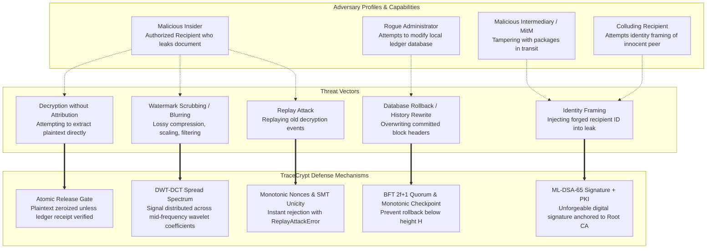

# TraceCrypt — Threat Model & Adversarial Mitigations

```mermaid
graph TD
    subgraph Adversaries["Adversary Profiles & Capabilities"]
        A1["Malicious Insider<br/>Authorized Recipient who leaks document"]
        A2["Rogue Administrator<br/>Attempts to modify local ledger database"]
        A3["Malicious Intermediary / MitM<br/>Tampering with packages in transit"]
        A4["Colluding Recipient<br/>Attempts identity framing of innocent peer"]
    end

    subgraph AttackVectors["Threat Vectors"]
        T1["Decryption without Attribution<br/>Attempting to extract plaintext directly"]
        T2["Identity Framing<br/>Injecting forged recipient ID into leak"]
        T3["Replay Attack<br/>Replaying old decryption events"]
        T4["Database Rollback / History Rewrite<br/>Overwriting committed block headers"]
        T5["Watermark Scrubbing / Blurring<br/>Lossy compression, scaling, filtering"]
    end

    subgraph Defenses["TraceCrypt Defense Mechanisms"]
        D1["Atomic Release Gate<br/>Plaintext zeroized unless ledger receipt verified"]
        D2["ML-DSA-65 Signature + PKI<br/>Unforgeable digital signature anchored to Root CA"]
        D3["Monotonic Nonces & SMT Unicity<br/>Instant rejection with ReplayAttackError"]
        D4["BFT 2f+1 Quorum & Monotonic Checkpoint<br/>Prevent rollback below height H"]
        D5["DWT-DCT Spread Spectrum<br/>Signal distributed across mid-frequency wavelet coefficients"]
    end

    A1 -.-> T1
    A1 -.-> T5
    A2 -.-> T4
    A3 -.-> T2
    A4 -.-> T2
    A1 -.-> T3

    T1 ==> D1
    T2 ==> D2
    T3 ==> D3
    T4 ==> D4
    T5 ==> D5
```
