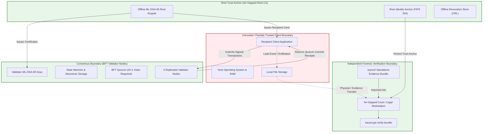

# TraceCrypt — Cryptographic Trust Boundaries & Perimeter

```mermaid
flowchart TB
    subgraph TrustDomainCA["Root Trust Anchor (Air-Gapped Root CA)"]
        RootKey["Offline ML-DSA-65 Root Keypair"]
        RootCert["Root Identity Anchor (FIPS 204)"]
        RevokeStore["Offline Revocation Store (CRL)"]
    end

    subgraph TrustDomainValidators["Consensus Boundary (BFT Validator Nodes)"]
        ValCluster["4 Replicated Validator Nodes"]
        ConsensusSM["State Machine & Monotonic Storage"]
        QuorumEngine["BFT Quorum (2f+1 Votes Required)"]
        ValKeys["Validator ML-DSA-65 Keys"]
    end

    subgraph UntrustedPerimeter["Untrusted / Partially Trusted Client Boundary"]
        ClientApp["Recipient Client Application"]
        LocalOS["Host Operating System & RAM"]
        DiskOut["Local File Storage"]
    end

    subgraph IndependentAuditor["Independent Forensic Verification Boundary"]
        Auditor["Air-Gapped Court / Legal Workstation"]
        ProofBundle[".tcproof Standalone Evidence Bundle"]
        VerifTool["tracecrypt verify-bundle"]
    end

    RootKey -->|Issues Certificates| ValKeys
    RootKey -->|Issues Recipient Certs| ClientApp
    RootCert -->|Pinned Trust Anchor| Auditor

    ClientApp -->|Submits Signed Transactions| ValCluster
    ValCluster -->|Returns Quorum Commit Receipts| ClientApp

    ClientApp -.->|Leak Event / Exfiltration| DiskOut
    DiskOut -.->|Physical / Evidence Transfer| Auditor
    ProofBundle -->|Imported into| Auditor
    Auditor --> VerifTool

    classDef secure fill:#e8f5e9,stroke:#2e7d32,stroke-width:2px;
    classDef boundary fill:#fff3e0,stroke:#e65100,stroke-width:2px;
    classDef untrusted fill:#ffebee,stroke:#c62828,stroke-width:2px;
    
    class TrustDomainCA,TrustDomainValidators,IndependentAuditor secure;
    class UntrustedPerimeter untrusted;
```
