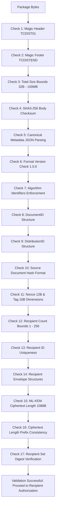

# The 17-Point Package Validation Pipeline

## 1. Threat Model & Defensive Philosophy

A `.tcdist` distribution package is untrusted binary input received across an air-gapped boundary or removable storage. An adversary may attempt:
* Modifying ciphertext or symmetric tags (bit-flipping / truncation).
* Replacing recipient envelopes or certificate serials.
* Injecting forged public keys or mismatched algorithm identifiers.
* Memory exhaustion via oversized packages or malformed length headers (denial-of-service).
* Replay or duplicate recipient injection.

**TraceCrypt Rule:** Before any cryptographic decapsulation or AES decryption is invoked, the package MUST pass the **17-Point Offline Validation Pipeline**.

Validation is strictly **fail-closed**: any anomaly raises a `PackageValidationError` and halts execution.

---

## 2. Validation Flowchart

---

## 3. Detailed Check Specifications

| Step | Validation Rule | Pass Criterion | Threat Mitigated |
|---|---|---|---|
| **01** | **Magic Header** | Starts with `b"TCDIST01"` | Non-package file format rejection |
| **02** | **Magic Footer** | Ends with `b"TCDISTEND"` | Truncated file or interrupted transmission |
| **03** | **Package Bounds** | Length $\ge 1,200$ bytes and $\le 104,857,600$ bytes (100 MB) | Memory exhaustion / DoS / malformed streams |
| **04** | **Body Checksum** | SHA3-256 over payload matches embedded 32-byte hash | Bit-rot, in-transit corruption, payload tampering |
| **05** | **Canonical JSON** | Valid RFC 8785 UTF-8 JSON; deserializes to `DistributionPackageHeader` | Syntax corruption, non-canonical injection |
| **06** | **Format Version** | `format_version == "1.0.0"` | Version mismatch, downgrade attacks |
| **07** | **Algorithm Identifiers** | `cipher == AES-256-GCM`, `kem == ML-KEM-768` | Cipher downgrade to classical primitives |
| **08** | **DocumentID** | Valid typed ID matching `^doc-[a-f0-9]{32}$` | ID injection, directory traversal strings |
| **09** | **DistributionID** | Valid typed ID matching `^dst-[a-f0-9]{32}$` | ID injection, distribution collision |
| **10** | **Source Document Hash** | 64-character lowercase hex string (SHA3-256) | Malformed digest, missing integrity anchor |
| **11** | **AES Dimensions** | Nonce == 12 bytes; Auth Tag == 16 bytes | Cryptographic parameter tampering |
| **12** | **Recipient Count** | $1 \le \text{len(recipients)} \le 256$ | Empty distribution or unbounded recipient spam |
| **13** | **Recipient Uniqueness** | All `recipient_id` values distinct | Duplicate recipient envelope attack |
| **14** | **Envelope Structure** | Every envelope satisfies `RecipientEnvelope` schema | Malformed recipient metadata |
| **15** | **KEM Ciphertext Size** | Base64-decoded `kem_ciphertext` exactly 1,088 bytes | Truncated or malformed ML-KEM ciphertext |
| **16** | **Ciphertext Length** | Offset $+$ declared ciphertext length matches exact payload size | Inconsistent stream bounds / heap overflow |
| **17** | **Recipient Digest** | Recomputed SHA3-256 over recipient IDs matches `recipient_set_digest` | Recipient list substitution / tampering |

---

## 4. Failure Modes & Exception Guarantees

Every step is enforced by `PackageValidator.validate()`. If any check fails:
* No private key operations or symmetric decryption routines are called.
* A structured `PackageValidationError` is raised containing the specific failure reason.
* The validation pipeline never leaks private cryptographic material or partial plaintext buffers.
